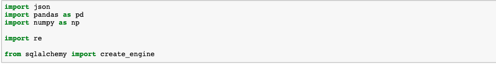
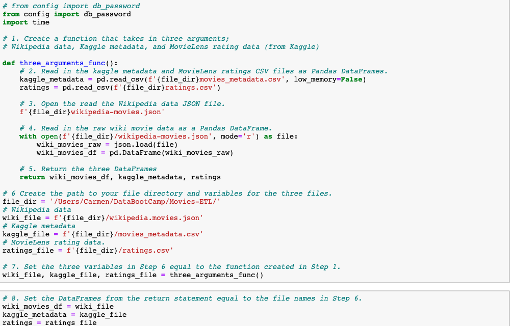
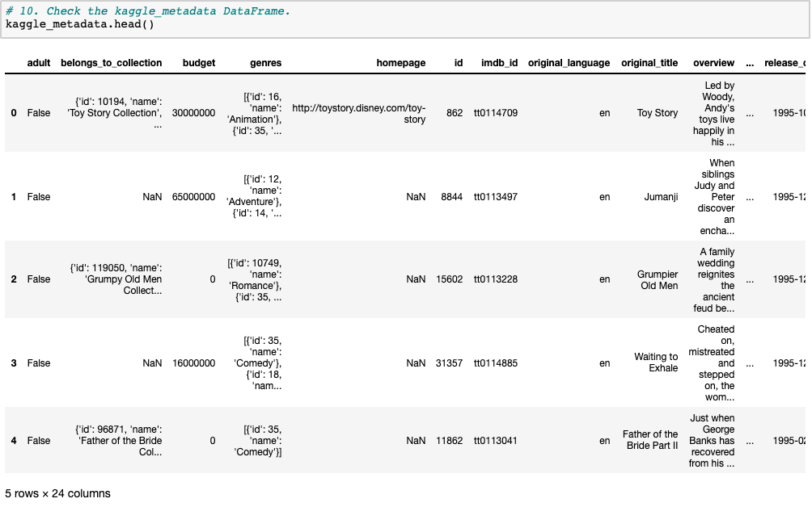
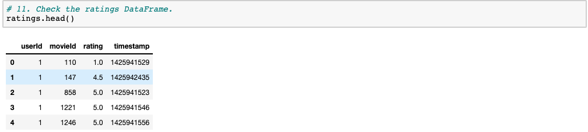
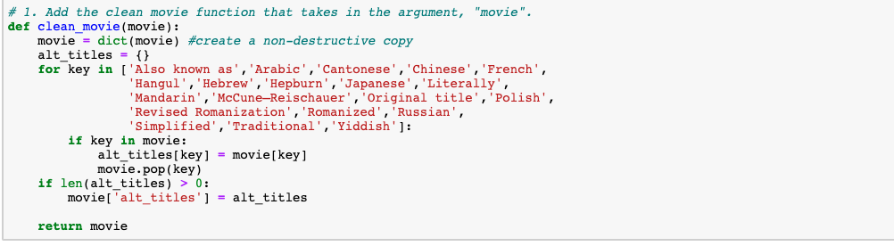
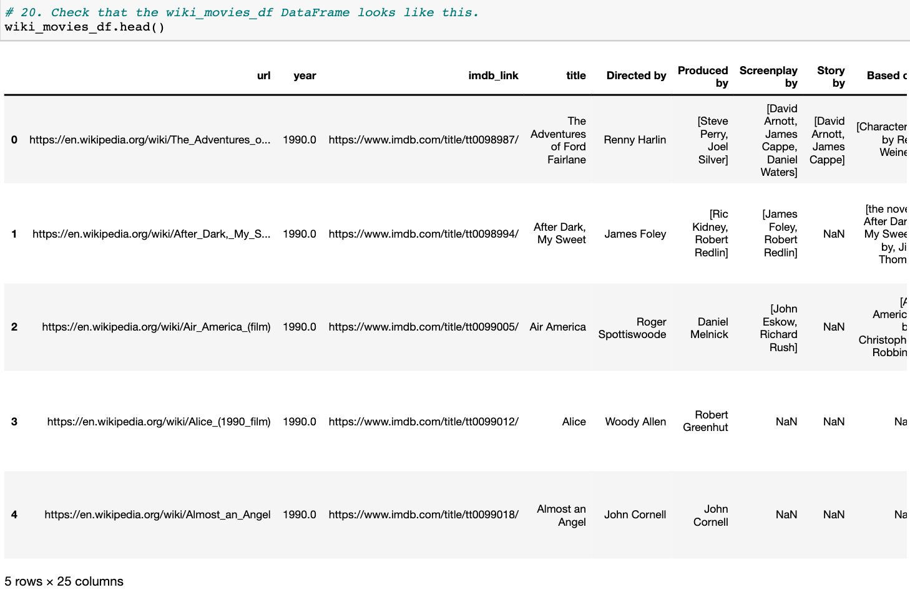
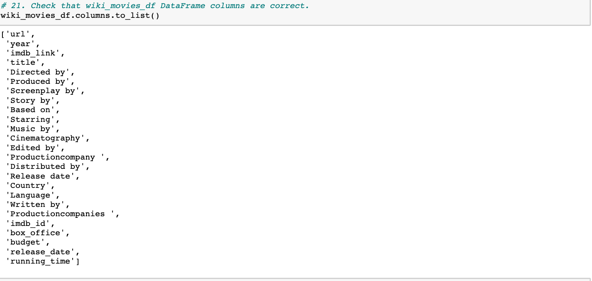
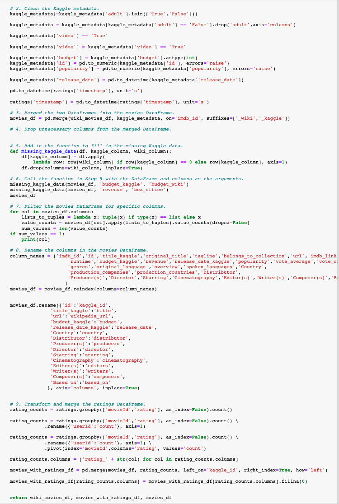
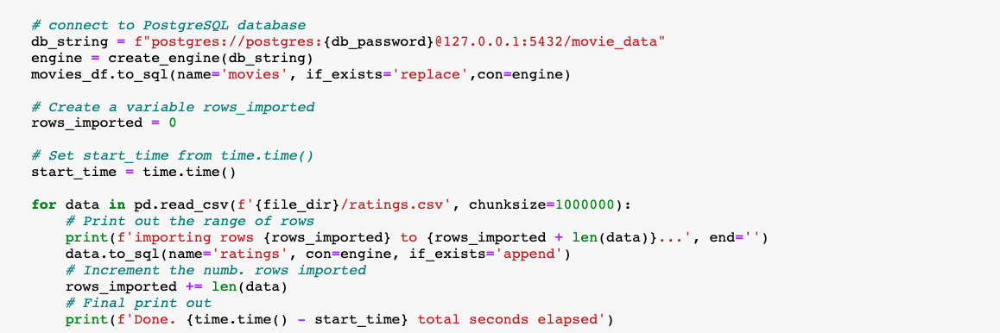
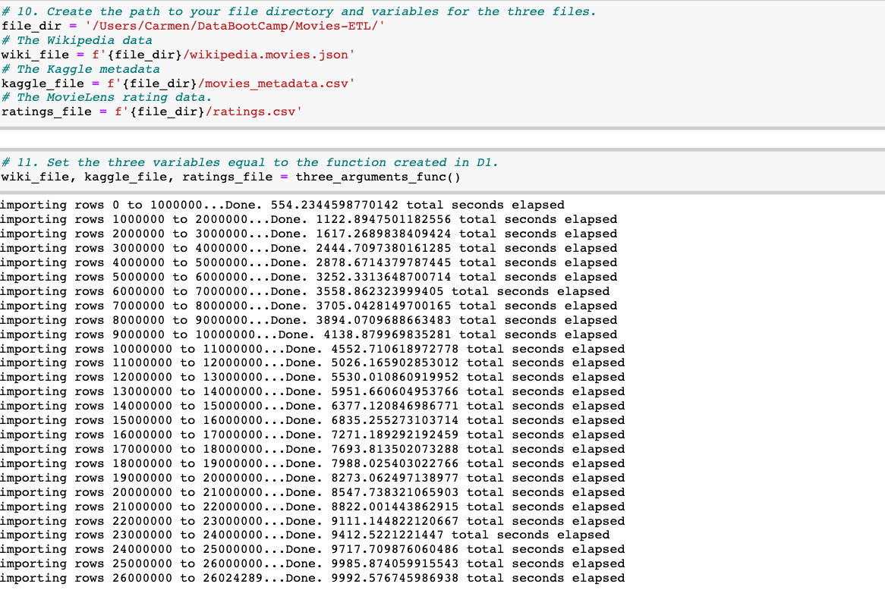

# PostgreSQL-Data-Warehouse

## Overview of the analysis
The purpose of this project is to create an automated pipeline that takes in new data, performs the appropriate transformations, and loads the data into existing tables. We will refactor the code from this module to create one function that takes in the three files: Wikipedia data, Kaggle metadata, and the MovieLens rating data and perform the ETL process by adding the data to a PostgreSQL database. 

The four technical analysis deliverables:

- Deliverable 1: Write an ETL Function to Read Three Data Files
- Deliverable 2: Extract and Transform the Wikipedia Data
- Deliverable 3: Extract and Transform the Kaggle data
- Deliverable 4: Create the Movie Database

## Resources:
- Data Source: crypto_data.csv
- Data Tools: PostgreSQL
- Software: Python 3.9, Visual Studio Code 1.50.0, Anaconda 4.8.5, Jupyter Notebook 6.1.4, pgAdmin 4.26 

## Results:

### Deliverable 1: Write an ETL Function to Read Three Data Files

The wiki_movies_df DataFrame

The kaggle_metadata DataFrame

The ratings DataFrame

### Deliverable 2: Extract and Transform the Wikipedia Data

###  Deliverable 3: Extract and Transform the Kaggle data

The Wikipedia and Kaggle DataFrames are merged.

### Deliverable 4: Create the Movie Database

